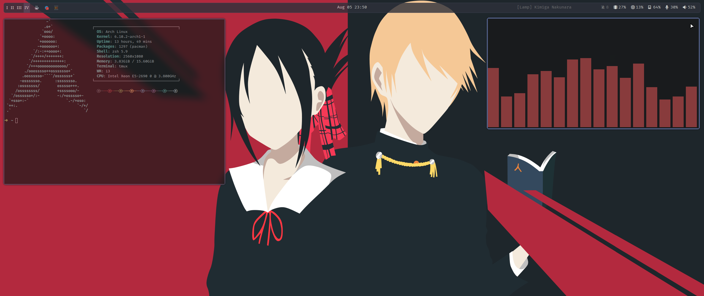

# Configs & DotFiles 🗂️

Just a personal repository to save some configuration files.
I created a simple Bash script that handles all the boring installation part for me. 😵 
You can run it by running `$ sh setup.sh`. _don't forget the sudo privileges._

## How dotfiles works? 🤓

In order to save my configuration files, I'm using stow, as a dotfiles manager. 
It can be applied by running: `$ stow */` 

## Instalation ✨

Pretty simple...

- `setup.sh` --> It will install everything I need.
- `neovim.sh` --> Setup my neovim environment.
- `ssh-key.sh` --> Generates a new SSH key (for GitHub).

## Jobs

- `health.sh` --> A simple script to check the health of my CPU and log errors ([systemd timer](./jobs/README.md)).
- `battery.sh` --> A simple script to check the battery of my Thinkpad ([systemd timer](./jobs/README.md))

OBS: Do not forget to set a ssh key before running `neovim.sh`

## Ricing 🍚

